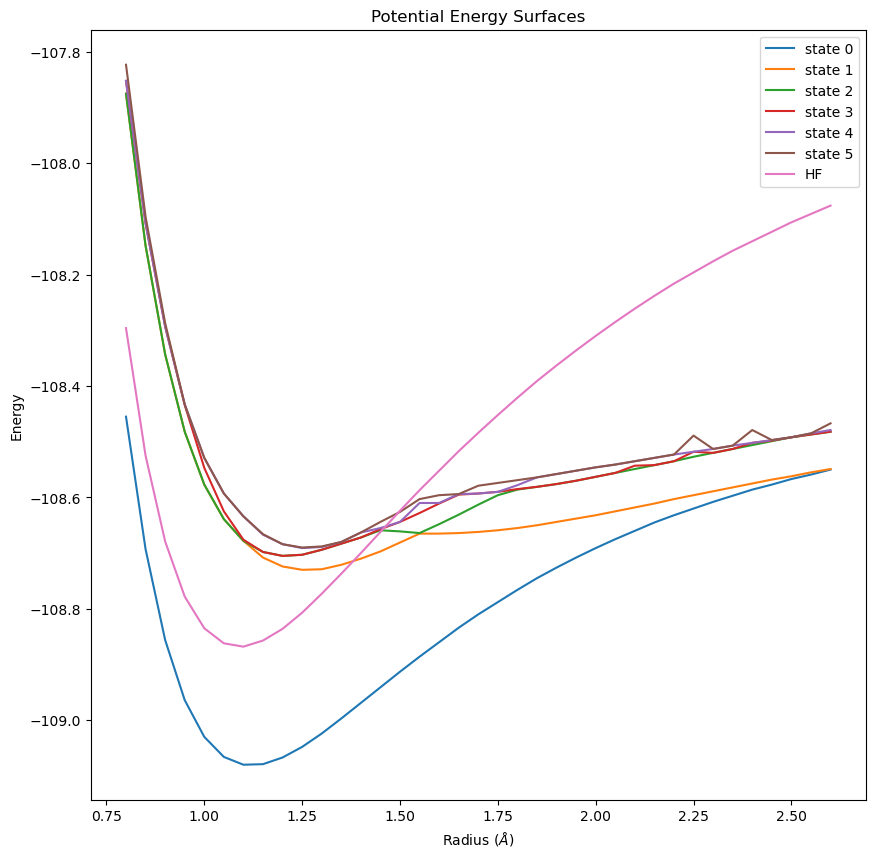

# Chem281: Problem Set 5
This repository contains the code to complete the problems for Problem Set 5.

## Files in this repository
- `linalg_routines.cpp` contains my implementation of the Davidson-Liu simultaneous expansion algorithm and the base Lanczos Method.
- `problem2.cpp` contains my implementation of the program described in Problem 2 of the problem set. It calculates the potential energy surfaces of the ground and five excited states for an N2 molecule.
- `test_diagnolize.cpp` program used to test the Davidson-Liu simultaneous expansion method.
- `data_types.h` contains a custom implementation of a vector, dense matrix, and sparse matrix datastructures.
- `eigen_solver.h` API to access the functions implemented in linalg_routines.cpp. Also contains an eigen_solver method that uses lapack.
- `integrals.h++` and `integrals.a` access to the integrals class which reads the integral files as well as calculates the Hamiltonian matrix elements.
- `plot.ipynb` Jupyter notebook used to plot the results from the program in Problem 2.
- `utilities.h` utilitie used to produce random numbers for random matrix creation.

## Compile the code in this repository
```
make
```
**Make sure the location of lapackpp is properly included in the flags specified in the Makefile**

## Problem 1:
The implementation for the Davidson-Liu simultaneous expansion method can be found in `linalg_routines.cpp`. This is an expansion of the Davidson method code I implemented in problem set 4.

In order to test the Davidson-Liu program for any number of eigenpairs on random sparse, symmetric matrices, run:
```
./test_diagnolize <matrix size> <sparsity> <number of eigen values>
```
**Note:** `test_diagnolize.cpp` calculates the eigen values that result from calling lapack as well as the Davidson-Liu method, so do not make the matrix size too large.


**Example:**
```
./test_diagonalize 2000, 0.01, 10
```

**Output:**
```
Eigen Value from Lapack
-541.29
-529.624
-529.194
-525.175
-524.003
-519.698
-517.776
-515.083
-511.788
-511.543

Sending to Davidson
Iterations: 47
Davidson estimate: 
-541.29
-529.624
-529.194
-525.175
-524.003
-519.698
-517.776
-515.083
-511.788
-511.543
```

**Example:**
```
./test_diagonalize 1000, 0.01, 6
```

**Output:**
```
Eigen Value from Lapack
-391.818
-380.632
-377.741
-374.843
-368.948
-367.084

Sending to Davidson
Iterations: 44
Davidson estimate: 
-391.818
-380.632
-377.741
-374.843
-368.948
-367.084
```

## Problem 2:
To run the code for Problem 2:
```
./problem2
```
**Note, this process will calculated the ground and first 5 excited states for all of the integral files and output the results to a csv in the data folder.**

The C++ implementation for this problem can be found in `problem2.cpp`.

(1) I used `bitset <64>` for the electronic configurations.

Example Base Configuration:
`0000000000000000000000000000000000000001111111000000000001111111`

(2) The many electron basis set was created using the following logic:
**Single excitation:**

Alpha electron in position [0:7] moves to position [7:18]

OR

Beta electron in position [18:25] moves to position [25:36]

**Double excitation:**

A combination of the single excitations above.

OR

A double alpha or double beta excitation.

This resulted in 8,394 total configurations.

Example of first excited state:
`0000000000000000000000000000000000000001111111000000000011111110`

(3) (4) and (5) Implemented as described in the problem set description.

After calculating the ground and first five excited states for all of the integral files, I was able to produce the following plot of the potential energy surfaces:



This image can also be found in `data/output`.

As we can see, there is a clear ground state at most of the radius values, however, many of the 5 excited states are very similar. Interestingly, the graph shows that different excited states might be more favorable at different molecular configurations. 

The Hartree Fock curve does a reasonable job of capturing the location of the radius with the lowest minimum energy, but does a poor job of capturing the ground or excited state curves. It has a much higher energy value at large radii.

The back tail of the excited states contains a few inconsisten values. This might be able to be eliminated by reducing the tolerance in the Davidson-Liu SEM.